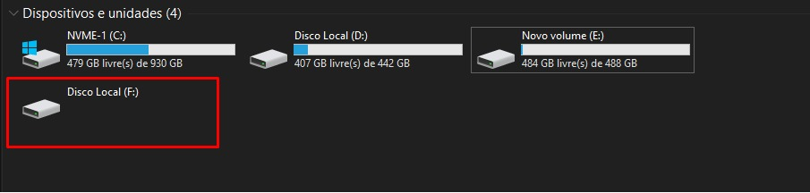
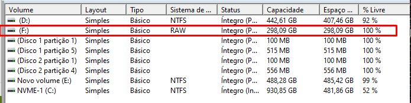

# Disco-com-falha-uso-da-ferramenta-ddrescue-para-recuperar

# 📌 Problema <br>
O problema começou quando o HD deixou de responder corretamente. Ao iniciar o sistema, havia lentidão e, posteriormente, o disco passou a aparecer como RAW, impossibilitando o acesso a arquivos (fotos, vídeos e materiais de estudo).



<br>

No Gerenciador de Disco do Windows, foi possível observar, Sistema de arquivos: "RAW" <br>


[DICA]<br>
Um sistema de arquivos RAW indica que o sistema operacional não consegue reconhecer a estrutura do disco (ex: NTFS). Isso pode ocorrer por:
  * Corrupção lógica (tabela de partição / MFT)
  * Bad blocks
  * Falha física inicial

👉 Nessa situação, não formate o disco. O correto é tentar recuperar os dados primeiro.

# 🧠 Estratégia adotada
Em vez de tentar acessar diretamente o disco (o que pode piorar a situação), foi utilizada uma abordagem segura:
  1. Clonar o disco defeituoso
  2. Trabalhar na cópia (e não no original)

Ferramenta utilizada: 
  * GNU ddrescue
  * Sistema: SystemRescue

Segue as etapas que eu usei e que me ajudou a resolver o problema:

## 🔧 Procedimento completo <br>
🔹 ETAPA 1 — Preparar o ambiente
  * Baixar a ISO do _SystemRescue_ <br>
  * Criar pendrive bootável <br>
      * Modo: ISO
      * Sistema de arquivos: FAT32
      * Configuração padrão funciona
        * Use: Rufus
---------------

🔹 ETAPA 2 — Boot Inicie pelo pendrive <br>
  * Escolha opção padrão:  _Boot SystemRescue using default options_
  * Aguardar carregar o ambiente completo
---------------

🔹 ETAPA 3 — Identificação dos discos
```bash
      lsblk -o NAME,SIZE,MODEL
```
Exemplo: <br>
/dev/sda → disco com problema <br>
/dev/sdb → disco destino (backup)

⚠️ Atenção: identificar corretamente os discos, parte crítica.

🔹 ETAPA 4 — Clonagem com ddrescue
🔸 Primeira passada (rápida e segura)

```bash
      ddrescue -f -n /dev/sda /dev/sdb /root/log.log
```

Vantagem: 
  * Copia apenas dados legíveis
  * Ignora setores defeituosos
  * Mais rápido

🔸 Segunda passada (recuperação de erros)
```bash
      ddrescue -d -r3 /dev/sda /dev/sdb /root/log.log
```
  * Tenta recuperar setores com erro
  * Até 3 tentativas por setor

  📊 Resultado obtido
  * ~99.99% dos dados recuperados
  * Pequena quantidade de setores defeituosos (~30 KB)
  * Disco clonado com sucesso

🧠 Por que essa abordagem funciona?

A clonagem:
  * Evita acesso direto ao disco defeituoso
  * Preserva dados antes que o disco piore
  * Permite múltiplas tentativas de recuperação

👉 Após a clonagem, o problema deixa de ser físico e passa a ser apenas lógico.

⚠️ Boas práticas importantes
 * Nunca trabalhar diretamente no disco original (/dev/sda)
 * Evitar montar discos com falha antes da clonagem
 * Não usar chkdsk antes da recuperação
 * Sempre validar dados após recuperação
   
🎯 Conclusão

A utilização do ddrescue permitiu recuperar praticamente todos os dados mesmo com o disco apresentando falhas.
Essa abordagem é recomendada principalmente quando:
 * O disco apresenta lentidão
 * O sistema de arquivos aparece como RAW
 * Há suspeita de falha física

🚀 Insight final

A clonagem não resolve o problema diretamente — ela preserva os dados para que a recuperação seja possível com segurança.
